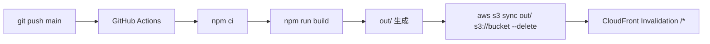

<!-- 生成日: 20260412 -->

# 技術仕様書 (Architecture Design Document)

## テクノロジースタック

### 言語・ランタイム

| 技術 | バージョン | 選定理由 |
|------|-----------|----------|
| Node.js | v24.11.0 | devcontainer標準搭載。Next.jsビルド環境として使用 |
| TypeScript | 5.x | 型安全性によるデータモデル・Props定義の明確化。ビルド時の型チェックでバグを早期検出 |
| npm | 11.x | Node.js v24.11.0に標準搭載。package-lock.jsonによる依存関係の厳密管理 |

### フレームワーク・ライブラリ

| 技術 | バージョン | 用途 | 選定理由 |
|------|-----------|------|----------|
| Next.js | 16.x | Webフレームワーク（App Router + Static Export） | Static Export対応、App Routerによるレイアウト共有、`next/font`によるGeistフォント標準搭載 |
| React | 19.x | UIライブラリ | Next.jsに内包。コンポーネントベースのUI構築 |
| Tailwind CSS | 4.x | スタイリング | CSS-first config（`@theme`）でDESIGN.mdデザイントークンとの統合が容易。ビルド時に未使用CSSを除去 |
| shadcn/ui | — | UIコンポーネントプリミティブ | Radix UIベースのアクセシブルなコンポーネント。Sheet（モバイルナビ）等で使用 |
| Framer Motion | — | アニメーション（Post-MVP P1） | ページ遷移・スクロールアニメーション。React向けの宣言的アニメーションライブラリ |

### 開発ツール

| 技術 | バージョン | 用途 | 選定理由 |
|------|-----------|------|----------|
| Biome | 2.x | フォーマッター + 汎用リンター | Rust製の高速ツール。Prettier + ESLint汎用ルールを1ツールに統合 |
| ESLint | 9.x | Next.js固有の静的解析 | `eslint-config-next` によるNext.js固有ルール（`@next/next/*`）のみ担当 |
| Vitest | 4.x | ユニットテスト・コンポーネントテスト | Vite互換の高速テストランナー。Jest互換APIでReact Testing Libraryと統合 |
| React Testing Library | — | コンポーネントテスト | ユーザー視点でのコンポーネントテスト |
| devcontainer | — | 開発環境 | 環境差分の排除。チーム開発・CI環境との一致 |

## アーキテクチャパターン

### 静的サイトアーキテクチャ

```
┌─────────────────────────────────────────────────────────────┐
│                    ブラウザ（クライアント）                      │
└──────────────────────────┬──────────────────────────────────┘
                           │ HTTPS
┌──────────────────────────▼──────────────────────────────────┐
│                    AWS CloudFront (CDN)                      │
│  - エッジキャッシュ                                           │
│  - HTTPS 終端 (ACM証明書)                                    │
│  - レスポンスヘッダー (CSP等)                                  │
└──────────────────────────┬──────────────────────────────────┘
                           │ オリジンリクエスト
┌──────────────────────────▼──────────────────────────────────┐
│                    AWS S3 (オリジン)                          │
│  - 静的ファイルホスティング                                    │
│  - /index.html, /about/index.html, ...                      │
│  - /_next/static/ (CSS, JS バンドル)                         │
│  - /images/ (静的画像)                                       │
└─────────────────────────────────────────────────────────────┘
```

このプロジェクトは完全な静的サイトであり、サーバーサイドランタイムを持たない。Next.js Static Exportでビルド時に全ページをHTMLファイルとして生成し、S3 + CloudFrontで配信する。

### コンポーネントアーキテクチャ（フロントエンド）

```
┌─────────────────────────────────────────────────────────────┐
│  App Router (layout.tsx)                                    │
│  ┌───────────────────────────────────────────────────────┐  │
│  │ Header + Sheet (モバイルナビ)                           │  │
│  ├───────────────────────────────────────────────────────┤  │
│  │ Page Content (各ページのpage.tsx)                      │  │
│  │  ┌─────────────────────────────────────────────────┐  │  │
│  │  │ Section Components                              │  │  │
│  │  │  ┌──────────┐ ┌──────────┐ ┌──────────┐       │  │  │
│  │  │  │ UI Parts │ │ UI Parts │ │ UI Parts │       │  │  │
│  │  │  └──────────┘ └──────────┘ └──────────┘       │  │  │
│  │  └─────────────────────────────────────────────────┘  │  │
│  ├───────────────────────────────────────────────────────┤  │
│  │ Footer                                                │  │
│  └───────────────────────────────────────────────────────┘  │
└─────────────────────────────────────────────────────────────┘
                           │
                    ┌──────▼──────┐
                    │ src/data/   │
                    │ (TSファイル)  │
                    └─────────────┘
```

#### レイヤー構成

| レイヤー | 配置 | 責務 |
|---------|------|------|
| ページレイヤー | `app/*/page.tsx` | ページの構成。データ読み込み、セクションの組み立て |
| セクションレイヤー | `components/home/`, `components/about/` 等 | ページ内セクションの表示ロジック |
| UIパーツレイヤー | `components/ui/` | 再利用可能な最小UIコンポーネント |
| レイアウトレイヤー | `components/layout/`, `app/layout.tsx` | 共通ヘッダー・フッター・ナビゲーション |
| データレイヤー | `src/data/` | コンテンツデータの定義・エクスポート |
| 型定義レイヤー | `src/types/` | 共有型定義（データモデルインターフェース） |

#### 依存ルール

- ページレイヤー → セクションレイヤー → UIパーツレイヤー（一方向）
- ページレイヤー → データレイヤー（直接importでデータ取得）
- レイアウトレイヤー → UIパーツレイヤー
- 全レイヤー → 型定義レイヤー
- UIパーツレイヤーはデータレイヤーに依存しない（Propsで受け取る）

## データ永続化戦略

### ストレージ方式

| データ種別 | ストレージ | フォーマット | 理由 |
|-----------|----------|-------------|------|
| コンテンツデータ | `src/data/*.ts` | TypeScript配列/オブジェクト | 型安全。ビルド時にバンドルに含まれる。CMS不要の規模 |
| 静的画像 | `public/images/` | PNG, WebP, SVG | Next.js public ディレクトリによる静的配信 |
| デザイントークン | `DESIGN.md` + `globals.css @theme` | Markdown + CSS | DESIGN.mdが真実の源泉、Tailwind v4 CSS-first configが実行時制約 |
| メタデータ | `src/data/metadata.ts` | TypeScript | SEO用メタ情報。App Router Metadata APIで使用 |

### バックアップ戦略

- **ソースコード**: GitHubリポジトリ（分散バージョン管理）
- **デプロイ済みファイル**: S3バケットに保存（S3バージョニングはインフラ側で検討）
- **復元方法**: `git checkout` + `npm run build` + GitHub Actions再デプロイ

## ビルド・デプロイアーキテクチャ

### Next.js Static Export設定

```typescript
// next.config.ts
const nextConfig: NextConfig = {
  output: 'export',           // Static Export有効化
  trailingSlash: true,        // /about → /about/index.html（S3ルーティング対応）
  images: {
    unoptimized: true,        // Static Export制約: Image Optimization API無効
  },
};
```

### ビルドパイプライン



**認証方式**: GitHub Actions OIDC連携（IAMアクセスキー不使用）

### リポジトリ分離

| リポジトリ | 責務 | 内容 |
|-----------|------|------|
| `cc_nextjs_portfolio` | アプリケーション | Next.jsソースコード、CI/CDワークフロー |
| `cc_aws_portfolio` | インフラ | Terraform（S3, CloudFront, IAM, ACM, Route53） |

**分離理由**:
- ライフサイクルの違い: アプリは頻繁に更新、インフラは安定後は変更少
- 権限分離: アプリCI/CDはS3書き込み+CF無効化のみ、インフラはフルAWS権限
- ツールの違い: npm + Next.js vs Terraform

## パフォーマンス要件

### レスポンスタイム

| 指標 | 目標値 | 測定方法 |
|------|--------|---------|
| LCP (Largest Contentful Paint) | 2.5秒以内 | Lighthouse |
| FID (First Input Delay) | 100ms以内 | Lighthouse |
| CLS (Cumulative Layout Shift) | 0.1以下 | Lighthouse |
| Lighthouse Performance | 90以上 | Lighthouse CI |

### リソース制約

| リソース | 上限 | 理由 |
|---------|------|------|
| JSバンドル（gzip後） | 200KB以下 | 3Gネットワークでの初回ロード体験を担保 |
| 画像（1枚あたり） | 200KB以下 | LCPへの影響を最小化 |
| HTMLファイル | 50KB以下/ページ | CDNキャッシュ効率の最大化 |
| 総ページ数 | 5ページ | MVP範囲。Static Exportビルド時間を最小限に |

### パフォーマンス最適化手法

| 手法 | 対象 | 効果 |
|------|------|------|
| Static Export | 全ページ | ランタイムゼロ。CDNエッジからの直接配信 |
| `next/font` | Geistフォント | セルフホスティングによるFOUT/FOIT防止、外部リクエスト排除 |
| Tailwind CSS v4 Treeshake | スタイルシート | 未使用CSSの自動除去。最終CSSサイズの最小化 |
| 画像手動最適化 | `public/images/` | WebP変換、適切なサイズへのリサイズ（Static Export制約によりImage API不使用） |
| Code Splitting | ページ単位 | App Routerによる自動ページ分割 |

## セキュリティアーキテクチャ

### 攻撃面の限定

静的サイトのため、攻撃面は大幅に限定される:
- サーバーサイドコードなし → サーバー脆弱性なし
- データベースなし → SQLインジェクションなし
- API Routesなし → API脆弱性なし
- ユーザー入力フォームなし（MVP） → XSSリスク最小

### 防御策

| 脅威 | 対策 | 実装場所 |
|------|------|---------|
| XSS（外部リンク経由） | `rel="noopener noreferrer"` を全外部リンクに付与 | ExternalLinkコンポーネント |
| クリックジャッキング | `X-Frame-Options: DENY` レスポンスヘッダー | CloudFront（インフラ側） |
| MIMEスニッフィング | `X-Content-Type-Options: nosniff` | CloudFront（インフラ側） |
| 中間者攻撃 | HTTPS強制（HTTP→HTTPSリダイレクト） | CloudFront + ACM（インフラ側） |
| 依存関係の脆弱性 | `npm audit` でゼロ脆弱性を維持 | CI/CDパイプライン |
| 個人情報漏洩 | 電話番号・住所等をソースコードに含めない | コードレビュー |
| サプライチェーン攻撃 | `package-lock.json` による依存関係の固定 | npm ci |

### CSP（Content Security Policy）

CloudFrontレスポンスヘッダーポリシーで設定（インフラ側）:

```
Content-Security-Policy:
  default-src 'self';
  script-src 'self' 'unsafe-inline';
  style-src 'self' 'unsafe-inline';
  img-src 'self' data:;
  font-src 'self';
  connect-src 'self';
  frame-ancestors 'none';
```

## スケーラビリティ設計

### アクセス増加への対応

- **CDN**: CloudFrontがエッジキャッシュにより全世界のアクセスを吸収
- **オリジン負荷**: S3は事実上無制限のスループット。静的ファイル配信のためスケーリング不要
- **コスト**: アクセス増加に比例するのはCloudFrontのデータ転送量のみ。S3ストレージは微小

### コンテンツ増加への対応

| データ | 現在想定 | 上限目安 | 対応方針 |
|--------|---------|---------|---------|
| プロジェクト数 | 3-5件 | 20件 | TSファイルで十分管理可能 |
| ブログ記事 | 5-10件 | 50件 | 50件超でCMS検討（Post-MVP） |
| スキル | 10-20件 | 50件 | TSファイルで十分管理可能 |
| 経歴 | 2-4件 | 10件 | TSファイルで十分管理可能 |

### 機能拡張性（Post-MVP）

| 機能 | 優先度 | 技術的影響 |
|------|--------|-----------|
| Framer Motionアニメーション | P1 | 依存追加のみ。アーキテクチャ変更なし |
| ダークモード | P2 | Tailwind `dark:` バリアント + テーマ切替ロジック |
| i18n（英語対応） | P2 | ディレクトリ構造変更（`/en/` プレフィックス）。ルーティング設計の見直し |
| OGP画像自動生成 | P2 | ビルドスクリプト追加。Static Export内で完結可能 |

## テスト戦略

### ユニットテスト

- **フレームワーク**: Vitest
- **対象**: ユーティリティ関数、データ変換ロジック（存在する場合）
- **カバレッジ目標**: ユーティリティ関数に対して80%以上

### コンポーネントテスト

- **フレームワーク**: Vitest + React Testing Library
- **対象**: 各UIコンポーネントのレンダリングと振る舞い
- **重点項目**:
  - 外部リンクのセキュリティ属性（`target`, `rel`）
  - ナビゲーションのアクティブ状態
  - レスポンシブ表示の切り替え（モバイルメニュー）

### ビルドテスト

- **方法**: CI/CDパイプラインで `npm run build` を実行
- **確認項目**:
  - ビルド成功（exit code 0）
  - `out/` に5ページ分の `index.html` が存在
  - TypeScript型エラーゼロ
  - Biome + ESLintエラーゼロ

### Lighthouseテスト

- **ツール**: Lighthouse CI または手動実行
- **基準**: Performance/Accessibility/Best Practices/SEO 各90以上
- **実行タイミング**: デプロイ後（本番URL対象）

## 技術的制約

### Next.js Static Export の制約

| 制約 | 影響 | 対応 |
|------|------|------|
| Image Optimization API 不使用 | 自動画像最適化なし | 手動でWebP変換・リサイズ。`images.unoptimized: true` |
| API Routes 不使用 | サーバーサイド処理なし | フォーム送信等は外部サービス連携（MVP外） |
| Dynamic Routes 制限 | 動的パス生成に `generateStaticParams` 必要 | 5ページ固定のためMVPでは不要 |
| Proxy 不使用（Next.js 16 で Middleware から改称） | リダイレクト・認証はサーバーランタイム不可 | CloudFront Functionsで対応（インフラ側） |

### 環境要件

- **開発環境**: devcontainer（Node.js v24.11.0）
- **CI環境**: GitHub Actions（`ubuntu-latest` + Node.js v24）
- **ビルド**: `npm ci && npm run build` が任意の環境で成功すること
- **最小ディスク容量**: 500MB（node_modules + ビルド出力）

## 依存関係管理

### プロダクション依存

| ライブラリ | 用途 | バージョン管理方針 |
|-----------|------|-------------------|
| next | Webフレームワーク | `^16.0.0`（メジャーバージョン内で自動更新） |
| react / react-dom | UIライブラリ | `^19.0.0`（Next.jsの要求バージョンに合わせる） |
| tailwindcss | スタイリング（devDependencies） | `^4.0.0` |
| @radix-ui/react-dialog | shadcn/ui Sheet基盤 | `^1.0.0` |
| clsx + tailwind-merge | className結合ユーティリティ（`cn`） | 最新 |
| framer-motion | アニメーション（P1） | 導入時に固定 |

### 開発依存

| ライブラリ | 用途 | バージョン管理方針 |
|-----------|------|-------------------|
| typescript | 型チェック | `~5.9.0`（パッチバージョンのみ自動） |
| @biomejs/biome | フォーマッター + 汎用リンター | `^2.0.0` |
| eslint + eslint-config-next | Next.js固有ルール | `^9.0.0` / `^16.0.0` |
| vitest | テストフレームワーク | `^4.0.0` |
| @testing-library/react | コンポーネントテスト | `^16.0.0` |

### 更新方針

- `npm audit` で脆弱性が報告された場合は即座にパッチ適用
- メジャーバージョンアップは変更内容を確認のうえ手動適用
- `package-lock.json` は必ずコミットし、`npm ci` で厳密に再現
