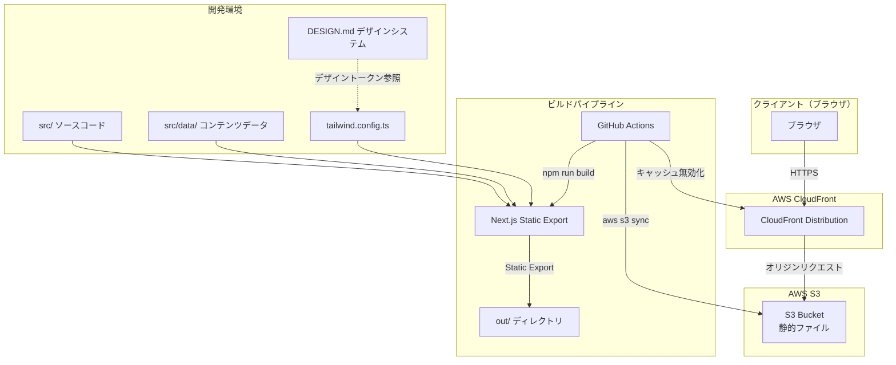
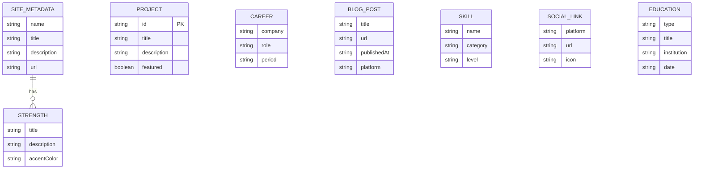
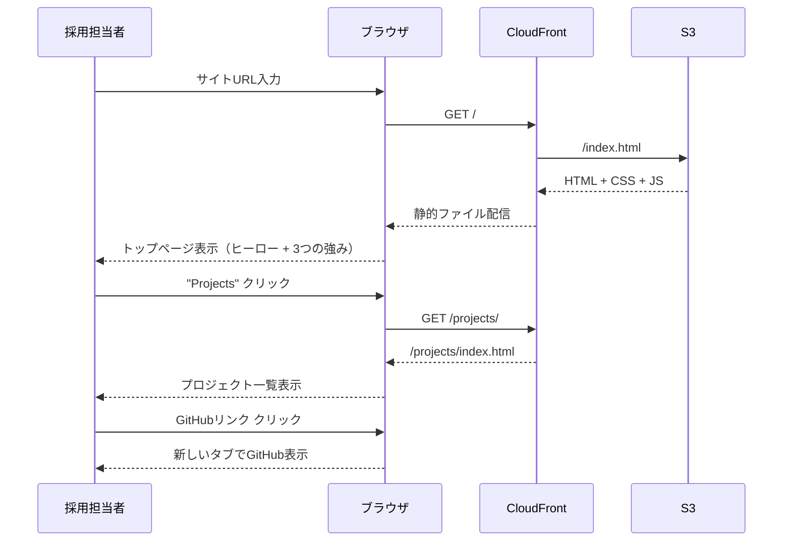
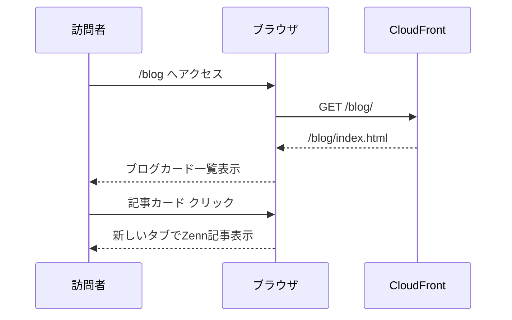
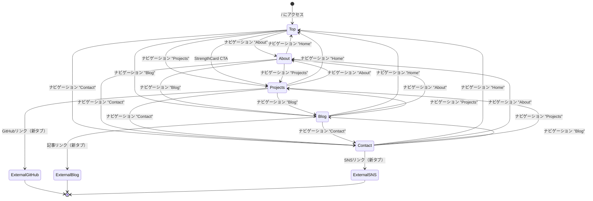

<!-- 生成日: 20260412 -->

# 機能設計書 (Functional Design Document)

## システム構成図



## 技術スタック

| 分類 | 技術 | バージョン | 選定理由 |
|------|------|-----------|----------|
| フレームワーク | Next.js (App Router) | 14+ | Static Export対応、App Routerによるレイアウト共有 |
| 言語 | TypeScript | 5.x | 型安全性によるデータモデル・Props定義の明確化 |
| スタイリング | Tailwind CSS | 3.x | ユーティリティベースでDESIGN.mdトークンとの統合が容易 |
| フォント | Geist Sans / Geist Mono | — | `next/font`標準搭載、DESIGN.md準拠のタイポグラフィ |
| デザインシステム | DESIGN.md (Vercel Inspired) | — | AIエージェント向けデザインシステム記述 |
| アニメーション | Framer Motion | — | Post-MVP (P1)。ページ遷移・スクロールアニメーション |
| CI/CD | GitHub Actions | — | OIDC認証によるS3デプロイ + CloudFrontキャッシュ無効化 |
| ホスティング | AWS S3 + CloudFront | — | 別リポジトリ(cc_aws_portfolio)でTerraform管理 |

## データモデル定義

### エンティティ: Skill（スキル）

```typescript
interface Skill {
  name: string;           // スキル名（例: "TypeScript"）
  category: SkillCategory; // カテゴリ
  level?: SkillLevel;     // 習熟度（任意）
  icon?: string;          // アイコン識別子（任意）
}

type SkillCategory =
  | 'language'      // プログラミング言語
  | 'framework'     // フレームワーク
  | 'cloud'         // クラウドサービス
  | 'tool'          // 開発ツール
  | 'database'      // データベース
  | 'other';        // その他

type SkillLevel = 'expert' | 'advanced' | 'intermediate' | 'beginner';
```

### エンティティ: Project（プロジェクト）

```typescript
interface Project {
  id: string;              // 一意識別子（slug形式: "portfolio-site"）
  title: string;           // プロジェクト名
  description: string;     // 概要（1-3文）
  longDescription?: string; // 詳細説明（Markdown可）
  technologies: string[];  // 使用技術タグ
  githubUrl?: string;      // GitHubリポジトリURL
  liveUrl?: string;        // 公開URL
  imageUrl?: string;       // サムネイル画像パス
  highlights?: string[];   // 設計判断・技術的ハイライト
  featured: boolean;       // トップページに表示するか
}
```

### エンティティ: Career（経歴）

```typescript
interface Career {
  company: string;         // 会社名
  role: string;            // 役職
  period: {
    start: string;         // 開始年月（"2023-04" 形式）
    end?: string;          // 終了年月（在籍中はundefined）
  };
  description: string;     // 業務概要
  achievements: string[];  // 主な成果（箇条書き）
  technologies?: string[]; // 使用技術
}
```

### エンティティ: BlogPost（ブログ記事リンク）

```typescript
interface BlogPost {
  title: string;           // 記事タイトル
  url: string;             // 外部URL（Zenn等）
  publishedAt: string;     // 投稿日（"2025-01-15" 形式）
  platform: BlogPlatform;  // 掲載プラットフォーム
  description?: string;    // 記事概要（1-2文）
  tags?: string[];         // タグ
}

type BlogPlatform = 'zenn' | 'qiita' | 'note' | 'amazon' | 'other';
```

### エンティティ: SocialLink（SNS・外部リンク）

```typescript
interface SocialLink {
  platform: string;        // プラットフォーム名（"GitHub", "X" 等）
  url: string;             // プロフィールURL
  icon: string;            // アイコン識別子（lucide-react のアイコン名。例: "github", "twitter", "mail"）
  label?: string;          // 表示ラベル（platformと異なる場合）
}
```

### エンティティ: Education（資格・学歴）

```typescript
interface Education {
  type: 'certification' | 'degree'; // 種別（資格 or 学歴）
  title: string;           // 資格名 or 学位名（例: "AWS Solutions Architect Associate"）
  institution?: string;    // 発行機関 or 学校名（例: "Amazon Web Services", "〇〇大学"）
  date: string;            // 取得日 or 卒業年月（"2024-03" 形式）
  description?: string;    // 補足説明（任意）
}
```

### エンティティ: SiteMetadata（サイトメタデータ）

```typescript
interface SiteMetadata {
  name: string;            // サイト名
  title: string;           // デフォルトタイトル
  description: string;     // デフォルトメタディスクリプション
  url: string;             // サイトURL
  ogImage: string;         // デフォルトOGP画像パス
  author: {
    name: string;          // 著者名
    tagline: string;       // 肩書き・キャッチコピー
    strengths: Strength[]; // 3つの強み
  };
}

interface Strength {
  title: string;           // 強みタイトル（例: "マルチクラウド"）
  description: string;     // 説明文
  accentColor: 'ship' | 'preview' | 'develop'; // Workflowアクセントカラー対応
}
```

### データ関連図



**制約**:
- 各データファイルは `src/data/` 配下のTypeScriptファイルで管理
- CMS不使用。データ更新はソースコード編集 → ビルド → デプロイのフロー
- すべてのデータは型定義に準拠し、ビルド時に型チェックされる
- アイコンライブラリ: `lucide-react` を使用。`icon` フィールドにはlucide-reactのアイコン名を文字列で指定する

## コンポーネント設計

### レイヤー構成

```
src/
├── app/                    # App Router（ページ・レイアウト）
│   ├── layout.tsx          # ルートレイアウト（Header + Footer + メタデータ）
│   ├── page.tsx            # トップページ（/）
│   ├── about/page.tsx      # 経歴・スキル（/about）
│   ├── projects/page.tsx   # プロジェクト一覧（/projects）
│   ├── blog/page.tsx       # ブログリンク集（/blog）
│   └── contact/page.tsx    # コンタクト（/contact）
├── components/             # 再利用可能なUIコンポーネント
│   ├── layout/             # レイアウト系
│   │   ├── Header.tsx
│   │   ├── Footer.tsx
│   │   └── Navigation.tsx
│   ├── home/               # トップページ専用
│   │   ├── HeroSection.tsx
│   │   └── StrengthCard.tsx
│   ├── about/              # Aboutページ専用
│   │   ├── Timeline.tsx
│   │   ├── TimelineItem.tsx
│   │   └── SkillGrid.tsx
│   ├── projects/           # Projectsページ専用
│   │   └── ProjectCard.tsx
│   ├── blog/               # Blogページ専用
│   │   └── BlogCard.tsx
│   ├── contact/            # Contactページ専用
│   │   └── SocialLinkCard.tsx
│   └── ui/                 # 汎用UIパーツ
│       ├── SectionHeading.tsx
│       ├── Badge.tsx
│       └── ExternalLink.tsx
├── data/                   # コンテンツデータ
│   ├── skills.ts
│   ├── projects.ts
│   ├── career.ts
│   ├── blog.ts
│   ├── social.ts
│   ├── education.ts
│   └── metadata.ts
└── types/                  # 型定義
    └── index.ts
```

### 共通レイアウトコンポーネント

#### Header

**責務**: グローバルナビゲーション、現在ページのハイライト表示、モバイルメニュー

```typescript
// Props
interface HeaderProps {}  // propsなし（パスは usePathname で取得）

// 内部状態
// - isMobileMenuOpen: boolean（モバイルメニュー開閉）
// - pathname: string（現在のパス、usePathname()）
```

**表示要素**:
- サイト名 / ロゴ（左寄せ）
- ナビゲーションリンク: Home, About, Projects, Blog, Contact
- 現在ページはweight 600 + アンダーライン
- モバイル: ハンバーガーメニューアイコン → スライドインメニュー

**デザイン準拠**:
- 背景: `#ffffff`、sticky配置
- 下部境界: shadow-as-border `rgba(0,0,0,0.08) 0px 0px 0px 1px`
- リンク: Geist 14px weight 500、色 `#171717`
- アクティブ: weight 600

#### Footer

**責務**: コピーライト表示、SNSリンク表示

```typescript
interface FooterProps {}  // propsなし（データは直接import）
```

**表示要素**:
- コピーライト: `© {year} {author.name}`
- SNSアイコンリンク（GitHub, X, connpass等）

**デザイン準拠**:
- 上部境界: shadow-as-border
- テキスト: Geist 14px weight 400、色 Gray 500 (`#666666`)

#### Navigation（モバイルメニュー）

**責務**: モバイル画面でのナビゲーション表示

```typescript
interface NavigationProps {
  isOpen: boolean;
  onClose: () => void;
}
```

**UX仕様**:
- 表示: 右側からスライドイン（`transform: translateX`）
- 背景: オーバーレイ `rgba(0,0,0,0.4)` を全画面に表示
- 閉じる条件: (1) ×ボタンクリック (2) オーバーレイクリック (3) ナビリンククリック（遷移後自動で閉じる） (4) Escapeキー
- メニュー幅: 画面幅の75%（最大300px）
- アニメーション: 200ms ease-out（Post-MVP Framer Motion導入後に強化可）
- アクセシビリティ: `aria-label="ナビゲーションメニュー"`、開閉時にフォーストラップを適用

### トップページコンポーネント（F1）

#### HeroSection

**責務**: ファーストビューでの自己紹介表示

```typescript
interface HeroSectionProps {
  name: string;            // 名前
  tagline: string;         // 肩書き・キャッチコピー
}
```

**表示要素**:
- 名前: Display Hero（Geist 48px weight 600、letter-spacing -2.4px）
- 肩書き: Body Large（Geist 20px weight 400、色 Gray 600 `#4d4d4d`）
- CTAボタン: "Projects を見る" → /projects へリンク
  - スタイル: DESIGN.md Primary Button準拠（背景 `#171717`、テキスト `#ffffff`、角丸 6px、パディング 10px 16px、Geist 14px weight 500）
  - ホバー: opacity 0.85
  - フォーカス: `outline: 2px solid #0072f5` + `outline-offset: 2px`

#### StrengthCard

**責務**: 3つの強みをカード形式で表示

```typescript
interface StrengthCardProps {
  title: string;           // 強みタイトル
  description: string;     // 説明文
  accentColor: 'ship' | 'preview' | 'develop'; // アクセントカラー
}
```

**表示要素**:
- タイトル: Card Title（Geist 24px weight 600、letter-spacing -0.96px）
- 説明文: Body Small（Geist 16px weight 400、色 Gray 600）
- アクセントカラーのインジケーター（上部ボーダーまたはアイコン）

**アクセントカラー対応**:
- マルチクラウド → Develop Blue (`#0a72ef`)
- AI駆動開発 → Preview Pink (`#de1d8d`)
- パフォーマンス改善 → Ship Red (`#ff5b4f`)

**カードデザイン**:
- 背景: `#ffffff`
- 角丸: 8px
- 影: Card Stack shadow（Tailwind トークン: `shadow-subtle-card`）

### Aboutページコンポーネント（F2）

#### Timeline

**責務**: 経歴データをタイムライン形式で表示

```typescript
interface TimelineProps {
  careers: Career[];       // 経歴データ配列（新しい順）
}
```

#### TimelineItem

**責務**: タイムライン上の個別経歴表示

```typescript
interface TimelineItemProps {
  career: Career;
  isLast: boolean;         // 最後の項目か（線の終端処理）
}
```

**表示要素**:
- 会社名: Sub-heading Large または Card Title
- 在籍期間: Caption（Geist Mono 12px weight 500、uppercase）
- 役割: Body Medium（Geist 16px weight 500）
- 成果: Body Small のリスト形式
- 使用技術: Badge（Pill形式）

#### SkillGrid

**責務**: スキル一覧をカテゴリ別グリッド表示

```typescript
interface SkillGridProps {
  skills: Skill[];
}
```

**表示要素**:
- カテゴリ見出し: Card Title Light
- スキルアイテム: Badge（Pill）形式
- カテゴリ別にグループ化して表示

### Projectsページコンポーネント（F3）

#### ProjectCard

**責務**: 個別プロジェクトのカード表示

```typescript
interface ProjectCardProps {
  project: Project;
}
```

**表示要素**:
- プロジェクト名: Card Title（Geist 24px weight 600）
- 概要: Body Small（Geist 16px weight 400、色 Gray 600）
- 技術タグ: Badge（Pill）配列
- GitHubリンク: ExternalLink
- ハイライト: リスト形式（存在する場合）
- サムネイル画像（存在する場合）: 12px top radius、`1px solid #ebebeb`

**カードデザイン**:
- 背景: `#ffffff`
- 角丸: 8px（画像あり: 12px）
- 影: Card Stack shadow（Tailwind トークン: `shadow-subtle-card`）
- ホバー: 影の強度微増

### Blogページコンポーネント（F4）

#### BlogCard

**責務**: ブログ記事リンクのカード表示

```typescript
interface BlogCardProps {
  post: BlogPost;
}
```

**表示要素**:
- 記事タイトル: Card Title Light（Geist 24px weight 500）
- 投稿日: Caption（Geist 12px weight 400）
- プラットフォーム: Badge（Pill）
- 概要: Body Small
- タグ一覧: Badge（Pill）
- リンク: `「{プラットフォーム名}で読む →」`（`target="_blank"`, `rel="noopener noreferrer"`）
- ルート要素は `<article>`（ProjectCard と同一パターン）

### Contactページコンポーネント（F5）

#### SocialLinkCard

**責務**: SNS・プラットフォームリンクの表示

```typescript
interface SocialLinkCardProps {
  platform: string;
  url: string;
  icon: string;
  label?: string;
}
```

**表示要素**:
- プラットフォームアイコン: DynamicIcon（lucide-react/dynamic）size 32
- プラットフォーム名: Body Medium（Geist 16px weight 500）
- リンク: `「{label ?? platform} →」`（外部 URL は `target="_blank"` + `rel="noopener noreferrer"`、`mailto:` は target/rel なし）
- ルート要素は `<article>`（ProjectCard / BlogCard と同一パターン）

### 汎用UIコンポーネント

#### SectionHeading

**責務**: ページ内セクション見出しの統一表示

```typescript
interface SectionHeadingProps {
  title: string;
  subtitle?: string;
}
```

**デザイン**:
- タイトル: Section Heading（Geist 40px weight 600、letter-spacing -2.4px）
- サブタイトル: Body Large（Geist 20px weight 400、色 Gray 600）

#### Badge

**責務**: 技術タグ・カテゴリラベルの表示

```typescript
interface BadgeProps {
  label: string;
  variant?: 'default' | 'blue' | 'accent';
}
```

**デザイン**:
- 背景: `#ebf5ff`（blue）/ `#f5f5f5`（default）
- テキスト: `#0068d6`（blue）/ `#4d4d4d`（default）
- 角丸: 9999px（Full Pill）
- パディング: 0px 10px
- フォント: Geist 12px weight 500

#### ExternalLink

**責務**: 外部リンクの安全な表示

```typescript
interface ExternalLinkProps {
  href: string;
  children: React.ReactNode;
  className?: string;
}
```

**実装要件**:
- `target="_blank"`
- `rel="noopener noreferrer"`
- Link Blue (`#0072f5`) テキストカラー

## ユースケース図

### UC1: 採用担当者がポートフォリオを閲覧する



### UC2: 訪問者がブログ記事を確認する



## 画面遷移図



**遷移ルール**:
- サイト内遷移: Next.js `<Link>` による同一タブ遷移（App Router client-side navigation）
- 外部遷移: `target="_blank"` + `rel="noopener noreferrer"` による新タブ遷移
- ナビゲーション: 全ページ共通Headerから5ページすべてにアクセス可能

## ページ構成詳細

### トップページ（/）

```
┌─────────────────────────────────────────────┐
│ Header（共通）                                │
├─────────────────────────────────────────────┤
│                                             │
│              HeroSection                    │
│        名前（Display Hero 48px）             │
│    肩書き・キャッチコピー（Body Large）         │
│         [CTAボタン: Projects を見る]          │
│                                             │
├─────────────────────────────────────────────┤
│                                             │
│   ┌───────────┐ ┌───────────┐ ┌───────────┐│
│   │ Strength  │ │ Strength  │ │ Strength  ││
│   │ Card      │ │ Card      │ │ Card      ││
│   │           │ │           │ │           ││
│   │マルチクラウド│ │AI駆動開発  │ │パフォーマンス││
│   │ (Blue)    │ │ (Pink)    │ │ (Red)     ││
│   └───────────┘ └───────────┘ └───────────┘│
│                                             │
├─────────────────────────────────────────────┤
│ Footer（共通）                                │
└─────────────────────────────────────────────┘
```

### 経歴・スキルページ（/about）

```
┌─────────────────────────────────────────────┐
│ Header（共通）                                │
├─────────────────────────────────────────────┤
│                                             │
│   SectionHeading: 経歴                       │
│                                             │
│   Timeline                                  │
│   ┌─ ● TimelineItem（現職）                  │
│   │    会社名 / 期間 / 役割 / 成果            │
│   ├─ ● TimelineItem                         │
│   │    会社名 / 期間 / 役割 / 成果            │
│   └─ ● TimelineItem                         │
│        会社名 / 期間 / 役割 / 成果            │
│                                             │
├─────────────────────────────────────────────┤
│                                             │
│   SectionHeading: スキル                     │
│                                             │
│   SkillGrid                                 │
│   言語:        [TS] [Python] [Go] ...       │
│   フレームワーク: [Next.js] [React] ...       │
│   クラウド:     [AWS] [GCP] ...              │
│   ツール:       [Terraform] [Docker] ...     │
│                                             │
├─────────────────────────────────────────────┤
│                                             │
│   SectionHeading: 資格・学歴                  │
│   （リスト形式で表示）                         │
│                                             │
├─────────────────────────────────────────────┤
│ Footer（共通）                                │
└─────────────────────────────────────────────┘
```

### プロジェクト一覧ページ（/projects）

```
┌─────────────────────────────────────────────┐
│ Header（共通）                                │
├─────────────────────────────────────────────┤
│                                             │
│   SectionHeading: Projects                  │
│                                             │
│   ┌──────────────────┐ ┌──────────────────┐ │
│   │  ProjectCard     │ │  ProjectCard     │ │
│   │  [サムネイル]     │ │  [サムネイル]     │ │
│   │  プロジェクト名   │ │  プロジェクト名   │ │
│   │  概要            │ │  概要            │ │
│   │  [TS][AWS][Next]  │ │  [TF][AWS]       │ │
│   │  [GitHub →]      │ │  [GitHub →]      │ │
│   └──────────────────┘ └──────────────────┘ │
│   ┌──────────────────┐                      │
│   │  ProjectCard     │                      │
│   │  ...             │                      │
│   └──────────────────┘                      │
│                                             │
├─────────────────────────────────────────────┤
│ Footer（共通）                                │
└─────────────────────────────────────────────┘
```

### ブログリンク集ページ（/blog）

```
┌─────────────────────────────────────────────┐
│ Header（共通）                                │
├─────────────────────────────────────────────┤
│                                             │
│   SectionHeading: Blog                      │
│                                             │
│   ┌─────────────────────────────────────┐   │
│   │  BlogCard (article)                 │   │
│   │  2025年1月15日  [Zenn]              │   │
│   │  記事タイトル                        │   │
│   │  記事概要テキスト...                 │   │
│   │  #tag1 #tag2                        │   │
│   │  Zennで読む →                       │   │
│   └─────────────────────────────────────┘   │
│   ┌─────────────────────────────────────┐   │
│   │  BlogCard (article)                 │   │
│   │  2025年1月10日  [Qiita]             │   │
│   │  記事タイトル                        │   │
│   │  記事概要テキスト...                 │   │
│   │  #tag1 #tag2                        │   │
│   │  Qiitaで読む →                      │   │
│   └─────────────────────────────────────┘   │
│                                             │
├─────────────────────────────────────────────┤
│ Footer（共通）                                │
└─────────────────────────────────────────────┘
```

### コンタクトページ（/contact）

```
┌─────────────────────────────────────────────┐
│ Header（共通）                                │
├─────────────────────────────────────────────┤
│                                             │
│   SectionHeading: Contact                   │
│                                             │
│   ┌───────────┐ ┌───────────┐ ┌───────────┐│
│   │ GitHub    │ │ X         │ │ connpass  ││
│   │ [icon]    │ │ [icon]    │ │ [icon]    ││
│   └───────────┘ └───────────┘ └───────────┘│
│   ┌───────────┐                             │
│   │ Email     │                             │
│   │ [icon]    │                             │
│   └───────────┘                             │
│                                             │
├─────────────────────────────────────────────┤
│ Footer（共通）                                │
└─────────────────────────────────────────────┘
```

## UI設計

### カラーコーディング

DESIGN.mdの定義に準拠:

| 用途 | 色 | 値 |
|------|------|------|
| 見出しテキスト | Vercel Black | `#171717` |
| 本文テキスト | Gray 600 | `#4d4d4d` |
| 補助テキスト | Gray 500 | `#666666` |
| プレースホルダー | Gray 400 | `#808080` |
| リンク | Link Blue | `#0072f5` |
| 背景 | Pure White | `#ffffff` |
| カード境界（shadow） | Border Shadow | `rgba(0,0,0,0.08) 0px 0px 0px 1px` |
| 強み: マルチクラウド | Develop Blue | `#0a72ef` |
| 強み: AI駆動開発 | Preview Pink | `#de1d8d` |
| 強み: パフォーマンス | Ship Red | `#ff5b4f` |

### レスポンシブ対応

DESIGN.mdのブレークポイントに準拠:

| 画面幅 | レイアウト変更 |
|--------|-------------|
| <600px | 1カラム。StrengthCard・ProjectCard・SocialLinkCard を縦積み。ハンバーガーメニュー表示 |
| 600-1024px | 2カラムグリッド。タブレット向け |
| >1024px | 2-3カラムグリッド。デスクトップ向け。最大幅1200px |

### タイポグラフィ適用マッピング

| コンポーネント | テキスト要素 | Typographyロール |
|--------------|------------|----------------|
| HeroSection | 名前 | Display Hero (48px/600/-2.4px) |
| HeroSection | 肩書き | Body Large (20px/400) |
| SectionHeading | タイトル | Section Heading (40px/600/-2.4px) |
| StrengthCard | タイトル | Card Title (24px/600/-0.96px) |
| StrengthCard | 説明文 | Body Small (16px/400) |
| ProjectCard | プロジェクト名 | Card Title (24px/600/-0.96px) |
| ProjectCard | 概要 | Body Small (16px/400) |
| BlogCard | 記事タイトル | Card Title Light (24px/500/-0.96px) |
| BlogCard | 日付 | Caption (12px/400) |
| Timeline | 会社名 | Card Title (24px/600/-0.96px) |
| Timeline | 期間 | Mono Small (12px/500/uppercase) |
| Badge | ラベル | Caption (12px/500) |
| Header | ナビリンク | Button/Link (14px/500) |
| Footer | コピーライト | Button/Link (14px/400) |

## ファイル構造

### データファイル配置

```
src/data/
├── metadata.ts     # サイトメタデータ・著者情報・3つの強み
├── skills.ts       # スキル一覧（カテゴリ別）
├── projects.ts     # プロジェクト一覧
├── career.ts       # 経歴データ（タイムライン用）
├── education.ts    # 資格・学歴データ
├── blog.ts         # ブログ記事リンク
└── social.ts       # SNS・外部リンク
```

### Static Export 出力構造

```
out/
├── index.html              # トップページ
├── about/
│   └── index.html          # 経歴・スキル
├── projects/
│   └── index.html          # プロジェクト一覧
├── blog/
│   └── index.html          # ブログリンク集
├── contact/
│   └── index.html          # コンタクト
├── _next/
│   ├── static/             # CSS・JS バンドル
│   └── ...
├── robots.txt
├── sitemap.xml
├── favicon.ico
└── images/                 # 静的画像
```

## パフォーマンス最適化

- **Static Export**: 全ページがビルド時に静的HTMLとして生成。サーバーサイド処理なし
- **フォント最適化**: `next/font` によるGeistフォントのセルフホスティング。FOUT/FOIT 防止
- **画像最適化**: `images.unoptimized: true`（Static Export制約）。手動での画像圧縮・WebP変換で対応
- **バンドルサイズ**: JavaScript 合計 200KB以下（gzip後）を目標。不要な依存を含めない
- **CDN配信**: CloudFrontのエッジキャッシュにより全世界への低レイテンシ配信
- **trailingSlash**: `true` 設定によりS3での`/about` → `/about/index.html` ルーティングを実現

## セキュリティ考慮事項

- **外部リンク**: すべての外部リンクに `rel="noopener noreferrer"` を付与（ExternalLinkコンポーネントで強制）
- **個人情報**: 電話番号・住所等をソースコードに含めない。メールアドレスは表示時にエンコードを検討
- **依存パッケージ**: `npm audit` で既知の脆弱性がゼロであることを確認
- **CSP**: CloudFrontレスポンスヘッダーでContent-Security-Policyを設定（インフラ側）
- **HTTPS**: CloudFront + ACM証明書による全通信のHTTPS化（インフラ側）

## エラーハンドリング

### 静的サイトにおけるエラー処理

| エラー種別 | 処理 | ユーザーへの表示 |
|-----------|------|-----------------|
| 404 Not Found | `app/not-found.tsx` でカスタム404ページを表示 | 「ページが見つかりません」 + トップページへの導線 |
| 外部リンク切れ | ビルド前のリンクチェックで検知 | — |
| 画像読み込みエラー | `alt` テキストによるフォールバック | 代替テキスト表示 |

**注**: 静的サイトのためランタイムエラーは最小限。エラーの大部分はビルド時に検出される。

## SEO対応

### メタデータ設定

```typescript
// app/layout.tsx での Metadata 設定例
import { Metadata } from 'next';

export const metadata: Metadata = {
  title: {
    default: 'Portfolio - エンジニアポートフォリオ',
    template: '%s | Portfolio',
  },
  description: 'マルチクラウド対応力・AI駆動開発・パフォーマンス改善を...',
  openGraph: {
    title: 'Portfolio',
    description: '...',
    url: 'https://example.com',
    siteName: 'Portfolio',
    images: [{ url: '/og-image.png', width: 1200, height: 630 }],
    type: 'website',
  },
  robots: { index: true, follow: true },
};
```

### 各ページのメタデータ

| ページ | title | description |
|--------|-------|-------------|
| / | Portfolio - エンジニアポートフォリオ | マルチクラウド・AI駆動開発・パフォーマンス改善の... |
| /about | 経歴・スキル | エンジニアとしての経歴、スキルセット、資格情報 |
| /projects | プロジェクト | 公開プロジェクト一覧。設計判断と使用技術 |
| /blog | ブログ | テックブログ記事・技術発信のリンク集 |
| /contact | コンタクト | SNS・プラットフォームへのリンク |

## テスト戦略

> テスト戦略の詳細（フレームワーク、実行方法、カバレッジ方針）は `docs/development-guidelines.md` のテスト戦略セクションを参照。
> ここでは機能設計の観点からコンポーネント別のテスト要件を定義する。

### コンポーネント別テスト要件

| コンポーネント | 優先度 | テスト観点 |
|--------------|--------|-----------|
| ExternalLink | 高 | `target="_blank"` と `rel="noopener noreferrer"` の付与 |
| Header | 高 | ナビゲーションリンク5本の存在、現在ページのweight 600ハイライト |
| Navigation | 高 | モバイルメニューの開閉、オーバーレイクリックで閉じる、リンク遷移で閉じる |
| Badge | 中 | ラベルテキストの表示、`default`/`blue`/`accent` バリアント別スタイル |
| ProjectCard | 中 | タイトル・概要・技術タグの表示、GitHubリンクのExternalLink使用 |
| BlogCard | 中 | article要素、外部リンクのセキュリティ属性、プラットフォームBadge・リンクラベルの表示 |
| StrengthCard | 中 | アクセントカラー3種の正しい適用 |
| Timeline | 低 | 経歴データの新しい順表示、最後の項目の線終端処理 |

### ビルド検証要件

- `npm run build` が成功する
- `out/` ディレクトリに全5ページが `*/index.html` 形式で出力される（`about/index.html`, `projects/index.html`, `blog/index.html`, `contact/index.html`, `index.html`）
- JavaScriptバンドルサイズが200KB以下（gzip後）
